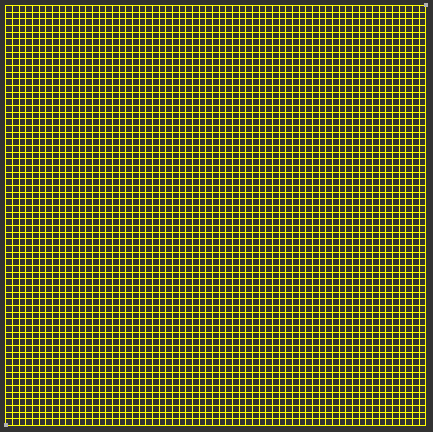

2D TPFA Tutorial
================

In this tutorial you will learn how to modify the parameters of a :class:`Kernel <padpy.Kernel.Kernel.KernelBase>`. More specifically, you will learn how to use the built-in :class:`TPFA Kernel<padpy.Kernel.TPFA.TPFAKernel>` as a 2D Kernel instead of a 3D Kernel.

You will also go through the entire process of running a numerical simulation with padpy.

Bulding the Mesh
----------------
The first step is to define the mesh file that will be used with the new `Kernel`. The mesh should be a 2D mesh. Below is listed an example of the geometry that generates a 2D, quadrilateral, structured mesh. This geometry file should be loaded on `Gmsh <http://gmsh.info/>`_.

.. code::
  :number-lines:

  Point(1) = {0, 0, 0, 1};
  Point(2) = {1, 0, 0, 1};
  Point(3) = {1, 1, 0, 1};
  Point(4) = {0, 1, 0, 1};
  Line(1) = {4, 1};
  Line(2) = {1, 2};
  Line(3) = {2, 3};
  Line(4) = {3, 4};
  Line Loop(5) = {4, 1, 2, 3};
  Plane Surface(6) = {5};

  Transfinite Line {1, 2, 3, 4} = 64;
  Transfinite Surface {6} = {1, 2, 3, 4};
  Recombine Surface {6};

  Physical Point(101) = {1};
  Physical Point(102) = {3};

  Physical Line(103) = {1, 2, 3, 4};
  Physical Surface(50) = {6};

This will generate a 64x64 mesh. If you want to change this later, you just need to replace the last value on line 12.

The generated mesh sould look like this:

Modifying the Kernels
---------------------
In padpy, the :class:`Kernel <padpy.Kernel.Kernel.KernelBase>` is an entity that will be executed on every mesh element of given dimension. The :class:`TPFA Kernel<padpy.Kernel.TPFA.TPFAKernel>` provided with padpy is capable of working with both 3D and 2D meshes, with the caveat that it works out of the box only with 3D meshes. To use it with 2D meshes, you will need to extend its functionalities.

The object-oriented nature of padpy allows for this to be reduced to a simple inheritance with class attributes overriding, given that the `Kernel` is built in a way that supports both kinds of parameters.

Each Kernel defines some class attributes. The first one we'll get through defines the **Kernel dependencies**. That is, which other `Kernels` should be executed first. This creates a dependency graph that will be resolved by padpy in the correct order. By default, the dependency list of a `Kernel` is set to an empty list.

The :class:`TPFA Kernel<padpy.Kernel.TPFA.TPFAKernel>` dependency list is set to:

.. code:: python
  :number-lines:

  depends = [EquivPerm, FillDiag, FillBoundary]

This means that the :class:`TPFA Kernel<padpy.Kernel.TPFA.TPFAKernel>` depends on the :class:`EquivPerm Kernel<padpy.Kernel.TPFA.EquivPerm>`, :class:`FillDiag Kernel<padpy.Kernel.TPFA.FillDiag>` and the :class:`FillBoundary Kernel<padpy.Kernel.TPFA.FillBoundary>` to work. This might mean that those Kernels preprocess some value that is needed, the boundary conditions, or anything else that can be processed **concurrently** (i.e. does not depend on each other).

The first step is then to verify each `Kernel` and see its class attributes.

By inspecting first the :class:`EquivPerm Kernel<padpy.Kernel.TPFA.EquivPerm>`, you can verify that its class attributes are:

.. code:: python
  :number-lines:

  elem_dim = 2
  bridge_dim = 2
  target_dim = 3
  depth = 1
  solution_dim = 2

You can verify what's the meaning of each one of those in the :class:`KernelBase <padpy.Kernel.Kernel.KernelBase>` documentation. Interpreting those attributes, and given that this `Kernel` works by default on 3D meshes, it should be clear that this `Kernel` is processing each 2-Dimensional face (from `elem_dim = 2`), and is gathering its two adjacent 3-Dimensional volumes (from `bridge_dim = 2`, `target_dim = 3` and `depth = 1`), and is then storing a processed value associated with those 2-Dimensional faces (from `solution_dim = 2`).

You need to change this, so that this `Kernel` will work as expected on 2D meshes. Basically, you need to reduce all dimensions by one. You will need to create another Kernel, inheriting all functionality from :class:`EquivPerm Kernel<padpy.Kernel.TPFA.EquivPerm>`, and overriding those attributes. You'll use the :class:`fill_vector decorator<padpy.Kernel.kernel_decorators.fill_vector>`, so that padpy knows that we want a Kernel that fills a vector instead of a matrix. Also, the new class needs to inherit from `TPFA.ElemCenter.kernel` instead of just `TPFA.ElemCenter`. This happens because if otherwise, the decorator would be applied twice. So, the `Kernel` class has this extra attribute, giving access to the original class, before the decorator modifies it.

The Final result is as follows:

.. code:: python
  :number-lines:

  @fill_vector()
  class EquivPerm(TPFA.EquivPerm.kernel):
    elem_dim = 1
    bridge_dim = 1
    target_dim = 2
    depth = 1
    solution_dim = 1

You should keep the same name if you want to use an extended `Kernel` within other `Kernel` that depends on it. This is to make sure that the matrix names and conventions are kept the same. If this is not done, the :class:`TPFA Kernel<padpy.Kernel.TPFA.TPFAKernel>` wouldn't be able to access the `EquivPerm` results properly.

Let's now extend :class:`FillDiag Kernel<padpy.Kernel.TPFA.FillDiag>`. The original class has the following attributes:

.. code:: python
  :number-lines:

  elem_dim = 3
  bridge_dim = 3
  target_dim = 3
  depth = 1
  solution_dim = 3

We shall then modify those to the according values for a 2D mesh:

.. code:: python
  :number-lines:

  @fill_matrix(name="T", share=True)
  class FillDiag(TPFA.FillDiag.kernel):
    elem_dim = 2
    bridge_dim = 2
    target_dim = 2
    depth = 1
    solution_dim = 2

Notice how we are now passing parameters to the :class:`fill_matrix decorator<padpy.Kernel.kernel_decorators.fill_matrix>`. Those parameters are set to be the same as in the original :class:`FillDiag Kernel<padpy.Kernel.TPFA.FillDiag>` class, to ensure consistency with the behaviour implementation. The first parameter, `name`, is the name of the array that will be filled. This name is just an identifier, and is supposed to be unique for each :class:`Mesh<padpy.Mesh.Mesh.Mesh>` object (i.e. you can have multiple Kernels with the same name, but none of them should be used together on a given :class:`Mesh<padpy.Mesh.Mesh.Mesh>`), except if the parameter `share` is set to `True`. In this case, you are allowed to have many Kernels with the same array name, as they will share and modify the same array.

If you understood those last concepts, the :class:`FillBoundary Kernel<padpy.Kernel.TPFA.FillBoundary>` will be straightforward. The original class has the same attributes as the :class:`FillDiag Kernel<padpy.Kernel.TPFA.FillDiag>`, and it uses the :class:`fill_vector decorator<padpy.Kernel.kernel_decorators.fill_matrix>` with the `name` parameter set to `"b"`. Therefore, the resulting extended class should look like:

.. code:: python
  :number-lines:

  @fill_vector(name="b")
  class FillBoundary(TPFA.FillBoundary.kernel):
    elem_dim = 2
    bridge_dim = 2
    target_dim = 2
    depth = 1
    solution_dim = 2

Finally, the :class:`TPFA Kernel<padpy.Kernel.TPFA.TPFAKernel>` will be extended. The original class has those attributes:

.. code:: python
  :number-lines:

  elem_dim = 2
  bridge_dim = 2
  target_dim = 3
  depth = 1
  solution_dim = 3

By applying the same logic as before, the resulting class should look like:

.. code:: python
  :number-lines:

  @fill_matrix(name="T", share=True)
  class TPFAKernel2D(TPFA.TPFAKernel.kernel):
    elem_dim = 1
    bridge_dim = 1
    target_dim = 2
    depth = 1
    solution_dim = 2

    depends = [EquivPerm, FillDiag, FillBoundary]

Notice here that we are setting the `name` parameter to the same matrix defined in the :class:`FillDiag Kernel<padpy.Kernel.TPFA.FillDiag>`, and the `share` parameter is set to `True`. This ensures that this kernel will access the same matrix that will be initialized by the :class:`FillDiag Kernel<padpy.Kernel.TPFA.FillDiag>`. Also, the `depends` attribute is overriden to a list containing the new defined kernels.

Defining the Physical Mappings
------------------------------
You are now ready to set the physical constraints associated with the problem. We first begin by inspecting the geometry file. It defines two physical points, four physical lines and one physical surface. Each of those is supposed to be mapped to a :class:`Physical<padpy.Physical.Physical.PhysicalBase>` subclass instance. There are many :class:`Physical<padpy.Physical.Physical.PhysicalBase>` subclasses that are built-into padpy, but you are free to define your own ones depending on your needs.

Let's associate the two physical points with two :class:`Dirichlet<padpy.Physical.Physical.Dirichlet>` boundary conditions. We can see that the physical ID of those two points are 101 and 102. Let's also associate each physical line with a :class:`Simmetry<padpy.Physical.Physical.Simmetry>` boundary condition. Those four lines are under the same physical ID of 103, and the physical surface with a :class:`Simmetry<padpy.Kernel.TPFA.TPFAPermeability>`.

Those associations are made using the :class:`PhysicalMap<padpy.Physical.PhysicalMap.PhysicalMap>` class.

This can be done as follows:

.. code:: python
  :number-lines:

  physical = PhysicalMap()
  physical[101] = Physical.Dirichlet(1.0)
  physical[102] = Physical.Dirichlet(-1.0)
  physical[103] = Physical.Symmetric()
  physical[50] = TPFA.TPFAPermeability(1.0)

Reading the Mesh
----------------
Reading the mesh is straightforward. Supposing that the generated mesh filename is `square.msh`, and is located in the same folder as the python script that you are building, it can be done as follows:

.. code:: python
  :number-lines:

  meshfile = 'square.msh'
  mf = MeshFactory()
  m = mf.load_mesh(meshfile, physical)

The second line creates a :class:`MeshFactory<padpy.Mesh.MeshFactory.MeshFactory>` instance, which is responsible for initializing and creating a mesh. You just have to call the `load_mesh` method with the filename and a :class:`PhysicalMap<padpy.Physical.PhysicalMap.PhysicalMap>` instance.

Creating the Pipeline
---------------------
The next step is to define the :class:`Kernel Pipeline<padpy.Problem.Pipeline.Pipeline>` that will be executed on the mesh. You can initialize it by passing an iterable object containing the Kernels that will be run in a mesh.

You can create a :class:`Kernel Pipeline<padpy.Problem.Pipeline.Pipeline>` as follows:

.. code:: python
  :number-lines:

  pipeline = Pipeline([
      TPFAKernel2D
  ])

Creating a Problem
------------------
In padpy, a :class:`Problem<padpy.Problem.Problem.ProblemBase>` is a class that is responsible for interfacing with a solver. For example, the :class:`LinearProblem<padpy.Problem.LinearProblem.LinearProblem>` class interacts with PyTrilinos interface to the AztecOO linear solvers.

To initialize a :class:`LinearProblem<padpy.Problem.LinearProblem.LinearProblem>` you must pass the mesh, the pipeline that will be executed on the mesh, and the dimension of the final solution of interest:

.. code:: python
  :number-lines:

  problem = LinearProblem(mesh=m, pipeline=pipeline, solution_dim=2)

Running the Problem
-------------------
Each problem might have many different optional steps and parameters that may or may not be of interest to the actual physical problem being studied. Those steps and parameters are supposed to be abstracted away with the use of a :class:`Runner<padpy.Problem.Runner.RunnerBase>` subclass.

The :class:`TPFA<padpy.Kernel.TPFA>` module provides a `Runner` that can be used with a :class:`LinearProblem<padpy.Problem.LinearProblem.LinearProblem>`:

.. code:: python
  :number-lines:

  runner = TPFA.TPFARunner(problem)
  runner.run()

The second line on the above snippet calls the `run()` method on the `Runner`, which will execute the steps necessary for the final objective: to solve the problem Tx = b for the vector x.

Exporting the Solution
----------------------
Finally, the solution can be exported with the :class:`LinearProblem<padpy.Problem.LinearProblem.LinearProblem>` method `export_solution`:

.. code:: python
  :number-lines:

  problem.export_solution(solution_name="Pressure", file_name="output_2d.vtk")

This will create a file named `"output_2d.vtk"`, that can be opened on your scientific visualizer of preference (ParaView or VisIt, for example).

Putting it All Together
-----------------------

The final script is summarized below, including the necessary imports.

.. literalinclude:: ../../../examples/tpfa_2d.py
