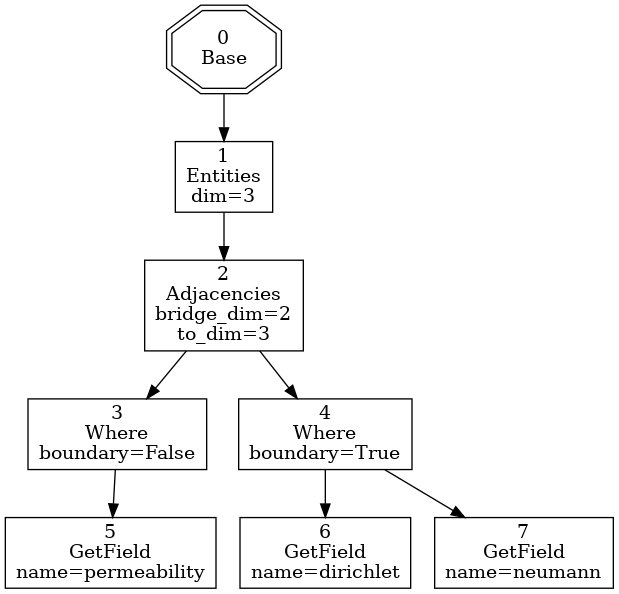

Simple DSL Tutorial
===================

In this tutorial you will learn how to create a :class:`DSL Contract <elliptic.Kernel.Contract.DSLContract>` and
a :class:`DSL Implementation <elliptic.Kernel.Contract.DSLImplementation>`.

Using the created DSL will also be covered by this tutorial.

The full example can be found at the `examples/DSL_Example` folder.

Defining the DSL Contract
-------------------------
The first step is to define the DSL design by creating a class that inherits from
:class:`~elliptic.Kernel.Contract.DSLContract`. This class will define the available operations for the DSL.

Each method in the DSL contract should call the method :meth:`~elliptic.Kernel.Contract.DSLContract.append_tree`
with an :class:`~elliptic.Kernel.Expression.Expression` object. `Expression` objects are the nodes that form
the DSL intermediate representation. The `append_tree` method will deal with modifying the DSL intermediate
representation by adding the new `Expression` object accordingly. In other words, in the picture below, which
shows an example of a DSL intermediate representation, each node is an `Expression` object representation.

To create an Expression object, you must pass a :class:`Context Delegate <elliptic.Kernel.Context.ContextDelegate>`
class (not an object!), plus two arguments representing the name of the node and its parameters, respectively.

For example, to create an `Expression` object that will render a node similar to the `Adjacencies` node
shown above, you could instantiate it this way:

.. code:: python

    Expression(context_delegate, "Adjacencies", {"bridge_dim": 2, "to_dim": 3})

So, let's create a DSL contract for a simple vectorized processor. That DSL should be able to execute
the following expression:

.. code:: python

    Range(start=0, count=100).ScalarSum(5).ScalarMult(2).Sum()

Where the `Range(start=0, count=100)` operation would generate 100 numbers starting from 0,
the `ScalarSum(5)` operation would sum 5 to each generated number, `ScalarMult(2)` would multiply the result
by 2, and `Sum()` would accumulate the results of the previous operations.

A pure python version of the above algorithm would be:

.. code:: python

    sum(((i+5)*2 for i in range(0, 100)))

This version is not as readable and expressive as the above ELLIPTIc expression, and it is also not as fast
as the code that will be generated, as will be shown in the end of this tutorial.

Together with the DSL Contract, a :class:`DSL Implementation <elliptic.Kernel.Contract.DSLImplementation>`
should be given. The DSL Implementation defines the expected `ContextDelegate` generating methods. Those
methods should return a :class:`Context Delegate <elliptic.Kernel.Context.ContextDelegate>` class.

We can begin by defining the abstract DSL Implementation:

.. code:: python

    class VectorImplementationBase(DSLImplementation):

        @abstractmethod
        def range_delegate(self, start, count):
            raise NotImplementedError

        @abstractmethod
        def scalar_mult_delegate(self, scalar):
            raise NotImplementedError

        @abstractmethod
        def scalar_sum_delegate(self, scalar):
            raise NotImplementedError

        @abstractmethod
        def sum_delegate(self):
            raise NotImplementedError

With the `@abstractmethod` decorators, we are telling Python ELLIPTIc that this class does not define a
concrete DSL Implementation, but actually what a concrete DSL Implementation should have to conform to the
DSL contract we will create. This way, it is possible to create the DSL Contract separated from the actual
implementation, and therefore, to have several possible implementations to the same contract.

This characteristic allows for high decoupling between DSL contracts and DSL implementations. It is therefore
possible to have an implementation for our DSL contract that would use, for example, a specialized third-party
library to perform specific computations. An algorithm built with the DSL contract would not need to know
the underlying implementation, and should yield the same results with any chosen implementation, given that
the implementation is correct.

We can now create the DSL contract for our vectorized processor:

.. code:: python

    class VectorContract(DSLContract[VectorImplementationBase]):

        def Range(self, start, count):
            return self.append_tree(Expression(self.dsl_impl.range_delegate(start, count), "Range"))

        def ScalarMult(self, scalar):
            return self.append_tree(Expression(self.dsl_impl.scalar_mult_delegate(scalar), "ScalarMult"))

        def ScalarSum(self, scalar):
            return self.append_tree(Expression(self.dsl_impl.scalar_sum_delegate(scalar), "ScalarSum"))

        def Sum(self):
            return self.append_tree(Expression(self.dsl_impl.sum_delegate(), "Sum"))

Here we are inheriting from :class:`~elliptic.Kernel.Contract.DSLContract`. The brackets in `DSLContract[VectorImplementationBase]`
are telling ELLIPTIc that this DSL contract expects a DSL implementation that inherits from `VectorImplementationBase`.

Each method in this class is defining an operation for the DSL. As explained before, those methods must
call `append_tree` with an `Expression` object. The `append_tree` method will create return an object of the
`VectorContract` class, allowing for method chaining.

Creating the DSL Implementation
-------------------------------
The next step is to define the DSL implementation. While the DSL contract creation step requires design planning
to support important features for the language, this is the most involved step in the process of creating
a DSL with ELLIPTIc. The DSL implementation defines how the Cython code will be generated.

First we must define the class that will inherit from `VectorImplementationBase`:

.. code:: python

    class VectorImplementation(VectorImplementationBase):
        ...

Let's begin by defining `base_delegate`, which should be responsible for creating and initializing
variables that will be used:

.. code:: python

    def base_delegate(self):
        class BaseDelegate(ContextDelegate):

            def get_template_file(self):
                return 'base.pyx.etp'

            def template_kwargs(self):
                return {'declare_variables': self.context.context['declare_variable'],
                        'return_variable': self.context.get_value('return_variable')}

            def context_enter(self):
                pass

            def context_exit(self):
                pass

        return BaseDelegate

Notice that this method returns a `ContextDelegate` called `BaseDelegate`. Every context delegate must implement
the methods shown above. The first method, `get_template_file`, tells ELLIPTIc where to look for the template file
containing the Cython template code (we will get to that soon). The `template_kwargs` method tells ELLIPTIc
which arguments should be passed to the template. `context_enter` and `context_exit` modify the context when
the node is visited and left in the intermediate representation tree.

The template files are `jinja2 <http://jinja.pocoo.org/docs/2.10/>`_ templates. The base.pyx.etp template is shown
below:

.. code::

    from libcpp.list cimport list as cpplist

    def run():
        cdef cpplist[unsigned long int] arr

        
        cdef {{ var_type }} {{ var_name }} = {{ initial_value }}
        

        {{ child|indent }}

        return {{ return_variable }}

Notice that this code has several template constructs such as `{{ var_type }}` and
`% for (var_type, var_name, initial_value) in declare_variables %}`. This allows for high flexibility when
designing the DSL implementation, as each node in the intermediate representation can communicate with each other
through the :class:`~elliptic.Kernel.Context.Context` object.

For example, the `BaseDelegate` class shown above will gather all variables that should be declared by
accessing `self.context.context['declare_variable']`, and will also gather the variable that holds the
value that should be returned by accessing `self.context.get_value('return_variable')`.

The `{{ child|indent }}` is necessary to render the code corresponding to the operations that happen afterwards.

The context object is basically a dictionary of stacks. In other words, it defines a `stack_name -> stack` mapping.

Let's now define a more complicated delegate:

.. code:: python

    def range_delegate(self, start, count):
        start = str(start)
        count = str(count)

        class RangeDelegate(ContextDelegate):

            def get_template_file(self):
                return 'range.pyx.etp'

            def template_kwargs(self):
                return {'count': count,
                        'index': self.context.get_value('current_index_name'),
                        'variable': self.context.get_value('current_variable_name'),
                        'counter': self.context.get_value('current_counter_name')}

            def context_enter(self):
                var_type = 'unsigned long int'
                loop_name = 'range' + str(self.unique_id)

                self.context.put_value('declare_variable', (var_type,
                                                            loop_name + 'var',
                                                            '0'))
                self.context.put_value('current_variable_name', loop_name + 'var')

                self.context.put_value('declare_variable', (var_type,
                                                            loop_name + 'counter',
                                                            start))
                self.context.put_value('current_counter_name', loop_name + 'counter')

                self.context.put_value('declare_variable', (var_type,
                                                            loop_name + 'index',
                                                            '0'))
                self.context.put_value('current_index_name', loop_name + 'index')

            def context_exit(self):
                self.context.pop_value('current_variable_name')
                self.context.pop_value('current_counter_name')
                self.context.pop_value('current_index_name')

        return RangeDelegate

The range delegate defines several values in the context. Each of those values will be available to the
next nodes in the intermediate representation tree. They will also be available to the range delegate itself
when it is going to be rendered.

In this case, the `context_enter` method is putting several values in the `'declare_variable'` stack.
This stack will be used by the base delegate to declare and initialize variables. Notice that the `context_enter`
method is repeating the values it is putting in the `'declare_variable'` into other stacks. This is because
since it is necessary for these values to still be available when the base template is rendered.

Therefore, the `'declare_variable'` stacked values are not removed when `context_exit` is called.

Since the `Range` operation consists of generating several values that will be processed, the corresponding
template looks like:

.. code::

    while {{ index }} < {{ count }}:
        {{ variable }} = {{ counter }}

        {{ child|indent }}

        {{ counter }} += 1
        {{ index }} += 1

The remaining delegates are much simpler. For example, the delegate for scalar multiplication looks like:

.. code:: python

    def scalar_mult_delegate(self, scalar):
        scalar = str(scalar)

        class ScalarMulDelegate(ContextDelegate):
            def get_template_file(self):
                return 'scalarmult.pyx.etp'

            def template_kwargs(self):
                return {'scalar': scalar,
                        'variable': self.context.get_value('current_variable_name')}

            def context_enter(self):
                pass

            def context_exit(self):
                pass

        return ScalarMulDelegate

This operation will basically modify the current variable, whose name is defined in the context
by the `'current_variable_name'` stack. The range delegate defines this stack and the variable name.
The template for the scalar multiplication is:

.. code::

    {{ variable }} = {{ variable }} * {{ scalar }}

    {{ child }}

The scalar sum delegate is very similar:

.. code:: python

    def scalar_sum_delegate(self, scalar: int) -> Type[ContextDelegate]:
        scalar = str(scalar)

        class ScalarSumDelegate(ContextDelegate):
            def get_template_file(self) -> str:
                return 'scalarsum.pyx.etp'

            def template_kwargs(self) -> Dict[str, Any]:
                return {'scalar': scalar,
                        'variable': self.context.get_value('current_variable_name')}

            def context_enter(self) -> None:
                pass

            def context_exit(self) -> None:
                pass

        return ScalarSumDelegate

And its template is also similar:

.. code::

    {{ variable }} = {{ variable }} + {{ scalar }}

    {{ child }}

The remaining delegate is the sum delegate. It will tell the base delegate to create an accumulation
variable, and to return this variable as the result of the computation, using the `'declare_variable'` and
`'return_variable'` stacks:

.. code:: python

    def sum_delegate(self):

        class SumDelegate(ContextDelegate):
            def get_template_file(self):
                return 'sum.pyx.etp'

            def template_kwargs(self):
                return {'variable': self.context.get_value('current_variable_name'),
                        'acc_variable': self.context.get_value('acc_variable_name')}

            def context_enter(self):
                self.context.put_value('declare_variable', ('int',
                                                            'acc' + str(self.unique_id),
                                                            '0'))
                self.context.put_value('acc_variable_name', 'acc' + str(self.unique_id))
                self.context.put_value('return_variable', 'acc' + str(self.unique_id))

            def context_exit(self):
                self.context.pop_value('acc_variable_name')

        return SumDelegate

The template code will simply accumulate the current variable value into the accumulating variable:

.. code::

    {{ acc_variable }} = {{ acc_variable }} + {{ variable }}

    {{ child }}

Finishing the DSL Implementation
--------------------------------
To finish the DSL implementation we must provide a :class:`~elliptic.Kernel.TemplateManager.TemplateManager`
and a :class:`~elliptic.Kernel.DSL.DSLMeta`. The template manager class is responsible for telling ELLIPTIc
where to look for the template files, and the DSL Meta tells ELLIPTIc if the DSL implementation has any
dependencies, such as include files and libraries that should be linked during the Cython compilation.

In our case, we are using plain Cython, so the DSL Meta class will be simple. Our template manager
will simply tell ELLIPTIc to look for templates in the `Templates` folder.

.. code:: python

    class VectorTemplateManager(TemplateManagerBase):

        def __init__(self) -> None:
            super().__init__(__package__, 'Templates')

    class VectorMeta(DSLMeta):

        def include_dirs(self) -> List[str]:
            return []

        def libs(self) -> List[str]:
            return []

Running the Example
-------------------
We can now create the DSL object. The :class:`DSL class <elliptic.Kernel.DSL.DSL>` takes a template manager,
a contract and a DSL meta object as arguments to its constructor. You must also pass the DSL implementation
when creating the contract object.

.. code:: python

    dsl = DSL(VectorTemplateManager(),
              VectorContract(VectorImplementation()),
              VectorMeta())

To use the DSL operations, your code must be within a context manager created by the `root` method from the
DSL object. Let's use the DSL to solve the same problem we defined in the beginning of the tutorial:

.. code:: python

    with dsl.root() as root:
        ents = root.Range(start=0, count=100).ScalarSum(5).ScalarMult(2).Sum()

This might take some time to compile, but after the compilation step is done you can reuse the resulting
compiled module freely:

.. code:: python

    print(dsl.get_built_module().run())

The `run()` function was defined in the base template.

Comparing the running times for the ELLIPTIc version and the pure Python version I obtained the following
results when running on my machine:

.. code:: python

    # Execution time for the elliptic version:
    t0 = time.time()
    for i in range(0, 50000):
        dsl.get_built_module().run()
    print(time.time() - t0)  # 0.11810016632080078

    # Execution time for the pure
    t0 = time.time()
    for i in range(0, 50000):
        sum(((i + 5) * 2 for i in range(0, 100)))
    print(time.time() - t0)  # 3.5026133060455322

Which indicates that the ELLIPTIc version is around 30x faster than the pure Python version.

The final generated Cython code is shown below:

.. code::

    from libcpp.list cimport list as cpplist

    def run():
        cdef cpplist[unsigned long int] arr

        cdef unsigned long int range1var = 0

        cdef unsigned long int range1counter = 0

        cdef unsigned long int range1index = 0

        cdef int acc4 = 0

        while range1index < 100:
            range1var = range1counter

            range1var = range1var + 5

            range1var = range1var * 2

            acc4 = acc4 + range1var

            range1counter += 1
            range1index += 1

    return acc4
